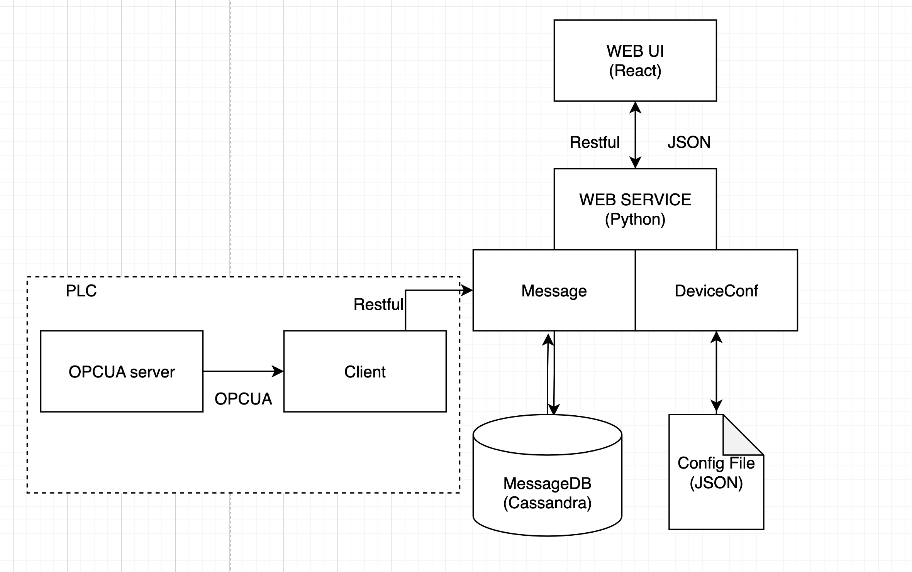

# Documentation


## Overview
The purpose of this project is to build device management system. Basically, users could config the device and save to JSON file in the server. Beside, the server is also able to collect message data from a mock PLC OPCUA server of devices by OPCUA communication.


## Features
1. As a user, he/she could see the information of device system in overview page
2. As a user, he/she could see the realtime message table in diagnostics page
3. As a user, he/she could upload a device config file in CSV and the system will change all the device information


## Requirement
1. Python > 3.6
2. virtualenv > 20
3. Docker
4. Node > 16


## Getting started

1. Start database server by running
```
docker-compose up -d
```

2. Start OPCUA server and client by running
```
pip install -r requirements.txt
cd plc-opc-ua-server
python server.py
python client.py
```

3. Start web server 
```
cd dm-service
uvicorn main:app --reload
```

4. Create env file for client
```
cd dm-client
touch .env

# Copy these config to .env file
VITE_BACKEND_HOST=127.0.0.1
VITE_BACKEND_PORT=8000
VITE_API_VERSION=v1
VITE_SOCKET_ID=1234
```
4. Start web app 
```
cd dm-client
pnpm install
pnpm run dev
```

## How to use the app


## Architecture



